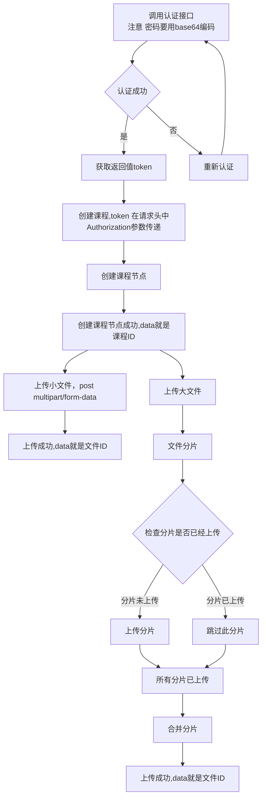
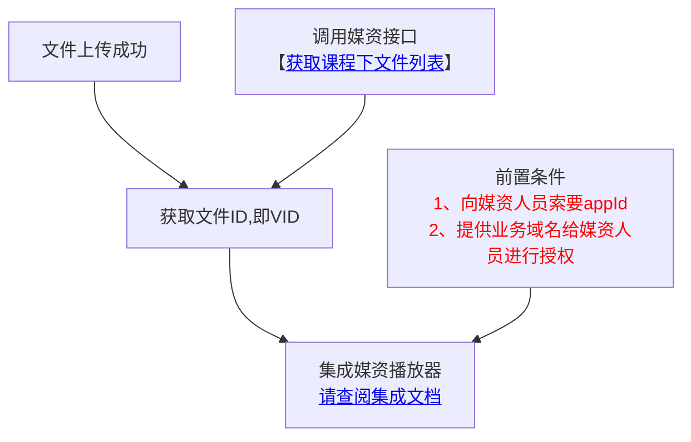

#  爱知汇开放平台demo

##  [接口文档](https://docs.apipost.net/docs/detail/3d789fea9001000?target_id=1bbf5c637c4016&locale=zh-cn) 文档密码联系管理员提供

## 使用接口需要所需要的参数（联系管理员获取）
- 认证账号密码
- 课程节点编号

## 文件上传流程

```mermaid
flowchart
    A[调用认证接口\n 注意 密码要用base64编码]-->B{认证成功}
    B --> |是|C[获取返回值token]
    B--> |否|D[重新认证]
    D-->A

    C --> E[创建课程,token 在请求头中Authorization参数传递]
    E-->F[创建课程节点]-->F1[创建课程节点成功,data就是课程ID]
    F1-->G[上传小文件，post multipart/form-data]
    G-->H[上传成功,data就是文件ID]
    F1-->G2[上传大文件]
    G2-->H2[文件分片]-->H3{检查分片是否已经上传}
    H3-->|分片未上传|H4[上传分片]
    H3-->|分片已上传|H6[跳过此分片]
    H4-->H5[所有分片已上传]
    H6-->H5[所有分片已上传]
    H5-->H7[合并分片]
    H7-->H8[上传成功,data就是文件ID]
```
## 文件预览

```mermaid
flowchart
A[文件上传成功]-->B[获取文件ID（VID）]
C[调用媒资接口<br>【<a href='https://docs.apipost.net/docs/detail/3d789fea9001000?target_id=1bcd9cfd7d50a3'>获取课程下文件列表</a>】
]-->B[获取文件ID,即VID]
B-->D[集成媒资播放器<br><a href="https://github.com/hey-future/player/tree/master/vue">请查阅集成文档<a>]
E[前置条件<br><font color="red">1、向媒资人员索要appId<br>2、提供业务域名给媒资人员进行授权</font>]-->D

```

